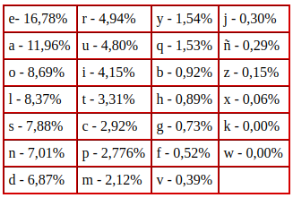

# Laboratorio: Cifrado simétrico

## Requisitos previos

- Máquina GNU/Linux: portátil, máquina virtual, o PC laboratorio (Entrar con credencial LDAP).
- Editor de código. En Visual Studio Code, pulsando ctrl+mayus+v renderiza este archivo de manera amigable (Sobre todo para imágenes).
- Herramientas necesarias: 

## Ataque fuerza bruta al cifrado César

Crea un programa, en el lenguaje que quieras, que realice un ataque de fuerza bruta contra el siguiente mensaje: "Uunejvxb dw vdwmx wdnex jzdr, nw wdnbcaxb lxajixwnb". Es decir, el programa tiene que inferir la clave y usarla para descifrar el mensaje (PISTA: detección de idioma en Python).

## Ataque fuerza bruta al cifrado simple por sustitución

Crea un programa, en el lenguaje que quieras, que realice un ataque de fuerza bruta contra el siguiente mensaje:

RIJ AZKKZHC PIKCE XT ACKCUXJHX SZX, E NZ PEJXKE, PXGIK XFDKXNEQE RIPI RIPQEHCK ET OENRCNPI AXNAX ZJ RKCHXKCI AX CJAXDXJAXJRCE AX RTENX, E ACOXKXJRCE AXT RITEQIKERCIJCNPI OKXJHXDIDZTCNHE AX TE ACKXRRCIJ EJEKSZCNHE.

AZKKZHC OZX ZJ OERHIK AX DKCPXK IKAXJ XJ XT DEDXT AX TE RTENX IQKXKE XJ REHETZJVE XJ GZTCI AX 1936. DXKI AZKKZHC, RIPI IRZKKX RIJ TEN DXKNIJETCAEAXN XJ TE MCNHIKCE, JI REVI AXT RCXTI. DXKNIJCOCREQE TE HKEACRCIJ KXvITZRCIJEKCE AX TE RTENX IQKXKE. NZ XJIKPX DIDZTEKCAEA XJHKX TE RTENX HKEQEGEAIKE, KXOTXGEAE XJ XT XJHCXKKI PZTHCHZACJEKCI XJ QEKRXTIJE XT 22 AX JIvCXPQKX AX 1936, PZXNHKE XNE CAXJHCOCRERCIJ. NZ PZXKHX OZX NCJ AZAE ZJ UITDX IQGXHCvI ET DKIRXNI KXvITZRCIJEKCI XJ PEKRME. NCJ AZKKZHC SZXAI PEN TCQKX XT REPCJI DEKE SZX XT XNHETCJCNPI, RIJ TE RIPDTCRCAEA AXT UIQCXKJI AXT OKXJHX DIDZTEK V AX TE ACKXRRCIJ EJEKSZCNHE, HXKPCJEKE XJ PEVI AX 1937 TE HEKXE AX TCSZCAEK TE KXvITZRCIJ, AXNPIKETCLEJAI E TE RTENX IQKXKE V OERCTCHEJAI RIJ XTTI XT DINHXKCIK HKCZJOI OKEJSZCNHE.

El mensaje está en castellano y deberás usar el análisis de frecuencias mediante la siguiente tabla:

(PISTA: el programa puede ser interactivo).

