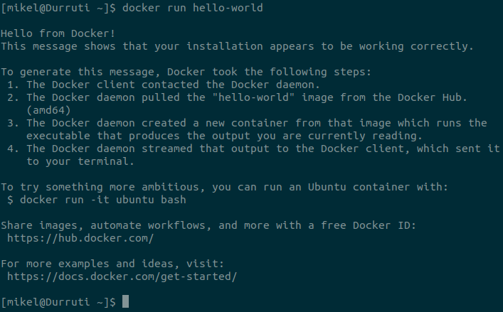
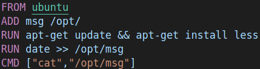
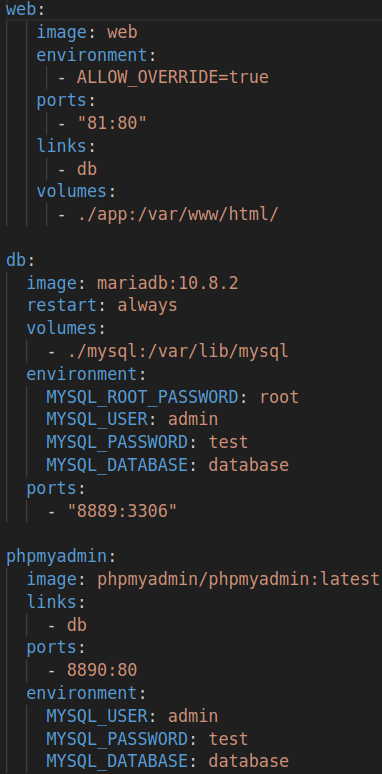
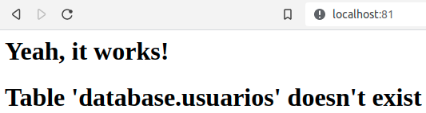

# Laboratorio: Docker

## Requisitos previos

- Máquina GNU/Linux: portátil, máquina virtual, o PC laboratorio (Entrar con credencial LDAP).
- Archivos Docker disponibles en eGela.
- Proyecto basico docker-compose disponible en GitHub.

## 1. Introduccion

[Docker](https://www.docker.com/) es una infraestructura de virtualización para GNU/Linux basada en contenedores. A diferencia de otras herramientas de virtualización como VirtualBox, el motor de Docker provee una capa intermedia entre los contenedores y el sistema operativo, de modo que no hay que virtualizar el sistema operativo “entero”, haciendo los contenedores mucho más ligeros. Es una herramienta muy popular que se usa para hacer despliegues de servicios fieles al entorno original, evitando asi el famoso "En mi local funciona" (pero en el de tu cliente no).

El elemento principal de Docker es la imagen: un archivo comprimido inmutable que contiene todo lo que necesita el servicio para funcionar (sistema, binarios, librerias, archivos, etc.). A partir de una imagen se pueden crear contenedores, que son ejecuciones aisladas, efímeras y mutables del servicio.

Docker tambien ofrece la posibilidad de crear repositorios de imagenes: el repositorio oficial contiene imagenes oficiales que se pueden reusar para construir servicios específicos.

## 2. Instalacion y configuracion

Para instalar Docker:

```bash
sudo apt install docker.io
```

Docker necesita privilegios de root. Para evitar el uso de sudo:

- Crear grupo docker:

```bash
sudo groupadd docker
```

- Añadir usuario actual al grupo docker:

```bash
sudo usermod -aG docker $USER
```

- Reiniciar el sistema, volver a entrar, y ejecutar:

```bash
docker run hello-world
```




## 3. Gestionar imagenes

Docker tiene un repositorio local que contiene las imagenes que vamos a usar en nuestro ordenador.

- Puedes ver las imagenes disponibles en tu repositorio local mediante:

```bash
docker images
```

El repositorio remoto mas comun se encuentra en Docker Hub, que es el repositorio configurado por defecto al instalar Docker.

- Explora las imagenes que se pueden encontrar en Docker Hub.

Vamos a descargar una imagen del repositorio remoto al repositorio local:

- Busca la imagen hello-world en Docker Hub.
- Descarga la imagen al repositorio local:

```bash
docker pull hello-world
```

Pregunta:

- ¿Con qué comando se suben imagenes a Docker Hub desde nuestro repositorio local?

## 4. Ejecutar containers

En Docker, los containers se ejecutan a partir de una imagen.

- Ejecuta un container a partir de la imagen hello-world:

```bash
docker run hello-world
```

Pregunta:

- ¿Qué output nos da la ejecución del container?

- Ejecuta:

```bash
docker run -it ubuntu bash
```

Preguntas:

- ¿De donde sale la imagen ubuntu?
- ¿Qué diferencia hay entre `docker run` y `docker run -it`?
- ¿Por qué ha cambiado el prompt de la terminal?
- Si hacemos un listado mediante ls, ¿A qué maquina pertenecen los directorios?
- ¿Qué output nos da el comando `docker ps -a`?

Para parar los contenedores, necesitamos su nombre o id:

```bash
docker kill nombre_o_id
docker ps -a
```

Aunque los contenedores no están funcionando, hay que eliminarlos:

```bash
docker rm nombre_o_id
docker ps -a
docker images
```

Preguntas:

- ¿Qué diferencia hay entre parar y borrar un contenedor?
- ¿Cómo afecta a la imagen de la que ha surgido el contenedor?
- ¿Cómo se borra una imagen?

Vuelve a ejecutar un contenedor desde la imagen ubuntu:

```bash
docker run -it ubuntu bash
```

En otra terminal:

```bash
docker exec nombre_container ls
```

Pregunta:

- ¿Qué diferencia hay entre `run` y `exec`?

## 5. Construir imagenes

Para construir una imagen Docker necesitamos un Dockerfile. Un Dockerfile es un archivo de texto plano que le dice a Docker como tiene que construir la imagen.

Por ejemplo:

- `FROM`: la imagen base a usar.
- `ADD`: añade archivos locales a la imagen.
- `RUN`: ejecuta comandos.
- `CMD`: el comando que se ejecutará al arrancar el contenedor a partir de la imagen descrita en el Dockerfile.



Pregunta:

- Cuando ejecutemos un contenedor a partir de esta imagen, ¿Qué output vamos a obtener? ¿Por qué?

Vamos a construir una imagen a partir del Dockerfile que se encuentra en eGela:

- Baja el Dockerfile de eGela, junto al archivo `msg` que contiene un mensaje.
- Ejecuta en el mismo directorio (El nombre puede ser cualquiera):

```bash
docker build -t="nombre" .
```

- Comprueba que la imagen ha sido construida y añadida al repositorio local:

```bash
docker images
```

- Ejecuta un contenedor de la imagen que acabamos de construir:

```bash
docker run nombre
```

Preguntas:

- ¿Qué output nos da al ejecutar el contenedor?
- ¿Cómo cambiarías el mensaje que se obtiene?

Docker nos permite montar directorios que son compartidos por el host y el contenedor, es decir que ambos pueden leer y escribir en esos directorios.

Para probarlo:

- Crea un directorio llamado `dir-msg` que contenga un archivo `msg2` con la cadena "iep":

```bash
mkdir dir-msg && echo "iep" > dir-msg/msg2
```

- Ejecuta un contenedor a partir de la imagen `ubuntu`, de manera interactiva, montando el directorio `dir-msg` dentro del contenedor en el directorio `/app`:

```bash
docker run -it -v "$(pwd)"/dir-msg:/app ubuntu bash
```

- Una vez dentro del contenedor, asegurate de que se ha montado correctamente:

```bash
cat /app/msg2
```

- En otra terminal, cambia el contenido de `dir-msg/msg2` y vuelve a ejecutar `cat /app/msg2` dentro del contenedor.

Preguntas:

- ¿Ha cambiado el contenido del archivo?
- ¿Por qué?

Los contenedores son, por definición, efímeros. Por lo tanto, los volumenes en Docker son muy importantes ya que nos permiten persistir datos que de otra manera se perderían al borrar el contenedor (Como lágrimas en la lluvia).

A la hora de desarrollar aplicaciones que se van a desplegar mediante Docker es muy comun trabajar de la siguiente manera:

1. Montar directorio de desarrollo con la aplicación y el directorio con los datos en el contenedor.
2. Desarrollar y hacer pruebas.
3. Cuando obtengamos una versión estable de la aplicación, anadirla al Dockerfile.

## 6. Ejecutar servicios

Mediante docker-compose podemos definir un grupo de servicios que se ejecuten a la vez de manera coordinada, basándose cada servicio en una imagen Docker. Teniendo en cuenta que hoy en dia muchas aplicaciones se basan en combinaciones de servicios (base de datos, servidor web, otros servidores, etc.), esta es una caracteristica muy importante.

Vamos a ver como funciona docker-compose explorando el proyecto que podeis usar como base para la entrega 1.

El proyecto consta de tres servicios que conforman una aplicacion web muy sencilla:

- Un servidor web con una aplicacion PHP (la aplicacion web propiamente dicha) que accede a una base de datos MariaDB.
- La base de datos MariaDB.
- Un servidor web con la aplicacion PHPMyAdmin para gestionar la base de datos MariaDB.

- Clona el repositorio de GitHub que contiene el proyecto (o descargalo):

```bash
git clone https://github.com/mikel-egana-aranguren/docker-lamp.git
```

El archivo docker-lamp/docker-compose.yml contiene la definicion de los servicios. En este caso hay tres servicios (el nombre del servicio y de la imagen Docker en la que se basa pueden ser diferentes):

- web: este servicio se basa en la imagen web construida a partir del Dockerfile, que contiene un servidor web Apache y una aplicacion PHP definida en /app (esta imagen es una extension de la imagen oficial de PHP). Se enlaza al servicio db y redirige el puerto 81 del host al puerto 80 del container (donde se ejecuta Apache).
- db: la imagen mariadb es la imagen oficial que provee la base de datos MariaDB. En este caso el servicio se ejecuta obteniendo los datos del volumen ./mysql (es decir, si volvemos a ejecutar un container, los datos se cargaran de ese directorio y no se perderan, aunque el container haya desaparecido), con la configuracion de la seccion environment y redirigiendo el puerto 8889 del host al puerto 3306 del container.
- phpmyadmin: este servicio se basa en la imagen oficial de PHPMyAdmin, que se conecta al servicio db y se usa para administrar la base de datos, redirigiendo el puerto 8890 del host al puerto 80 del container.




Para desplegar el proyecto:

- Situa la terminal dentro del repositorio docker-lamp.
- Construye la imagen web:

```bash
docker build -t="web" .
```

- Despliega los servicios mediante:

```bash
docker-compose up
```

- Visita la web en http://localhost:81
- Para anadir los datos necesarios, visita http://localhost:8890/ (tal y como lo hemos definido en docker-compose.yml, usuario admin, password test).
- Haz click en database y luego en import, desde donde eliges el archivo docker-lamp/database.sql.
- Vuelve a http://localhost:81, deberia tener mas informacion.

Para parar los servicios, en otra terminal:

```bash
docker-compose down
```




