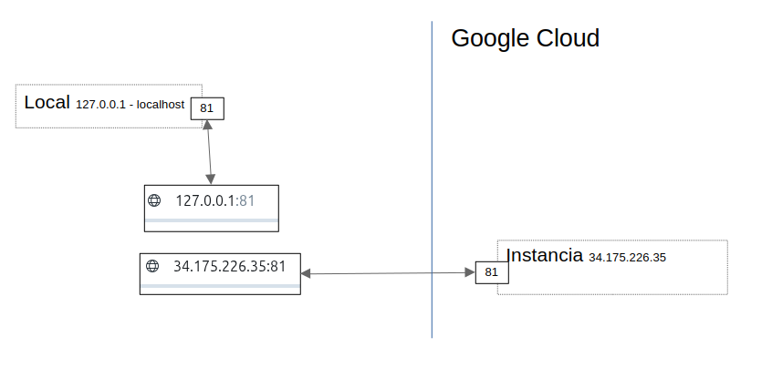
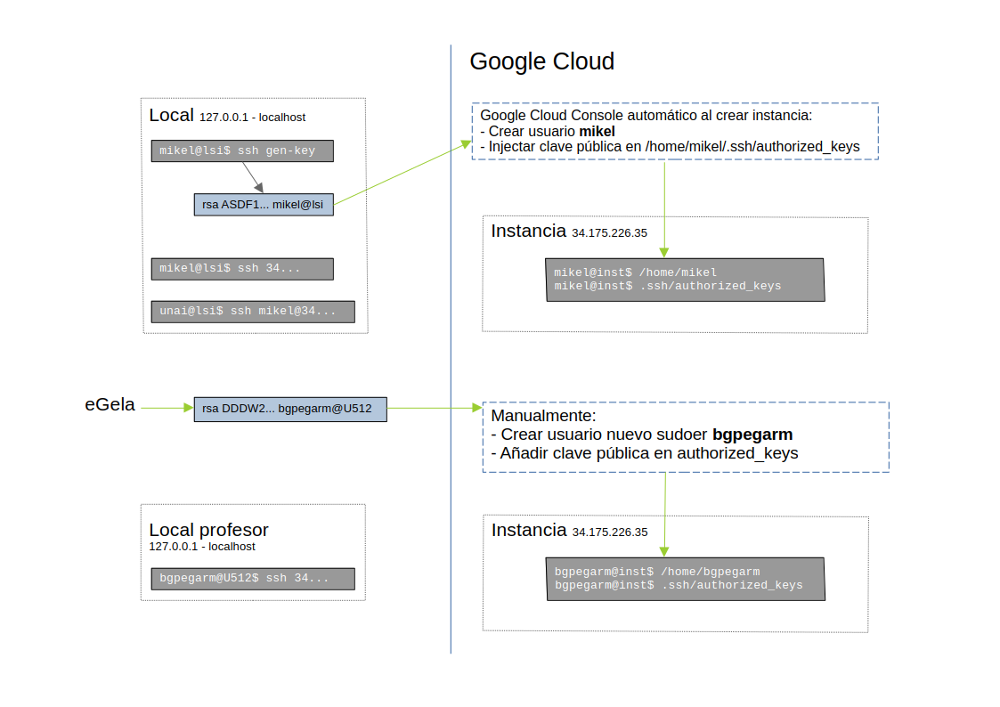
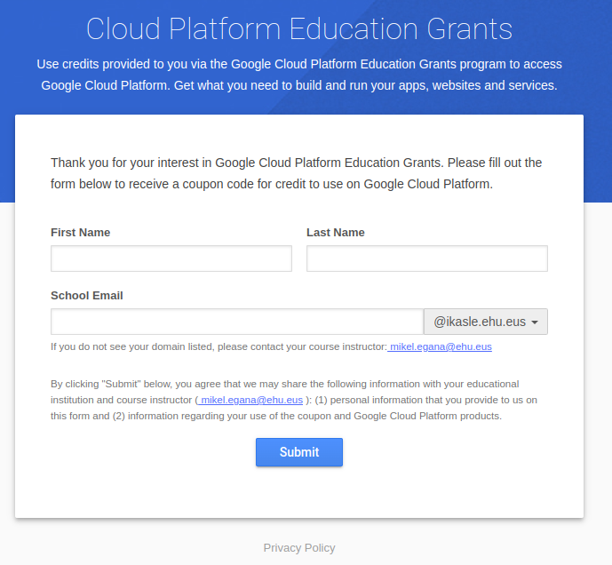
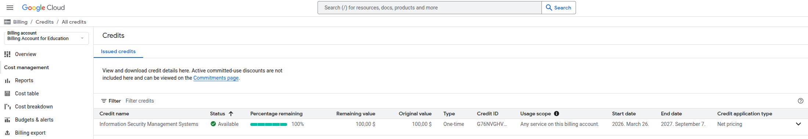
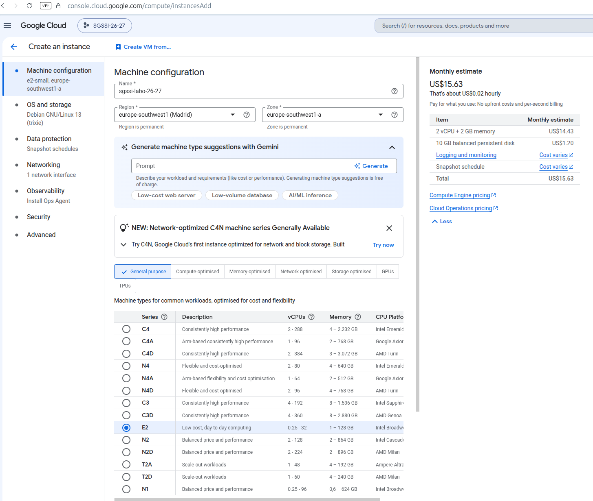
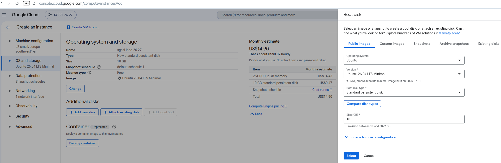
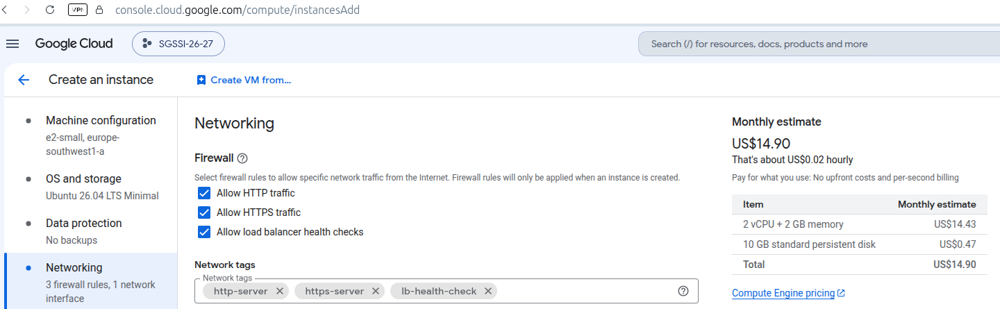
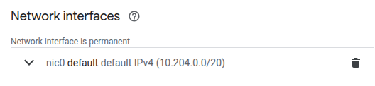
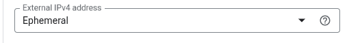
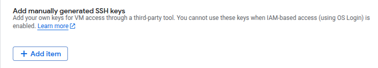

# Laboratorio: Servidor remoto Google Cloud

## Requisitos previos

- Editor de código. En Visual Studio Code, pulsando ctrl+mayus+v renderiza este archivo de manera amigable (Sobre todo para imágenes).
- Dos cuentas de correo: 
  - Correo universidad (@ehu.eus, @ikasle.ehu.eus) para obtener los créditos Google Cloud.
  - Correo Gmail nuevo (Por ejemplo mi_nombre_sgssi_26_27@gmail.com) para usar el servicio Google Cloud durante el curso.
- Pareja de claves SSH pública y privada (Se puede usar la misma que para GitHub o generar una nueva).

## Introducción

[Google Cloud](https://cloud.google.com/) es la plataforma de Google para computación en la nube. Ofrece créditos gratuitos para [educación](https://cloud.google.com/billing/docs/how-to/edu-grants) que usaremos para crear un servidor y trabajar con él, conectándonos al mismo mediante SSH. 





## Obtener el crédito y crear un proyecto

Entrar en Gmail en la cuenta creada para el curso (**IMPORTANTE**: no tiene que haber ninguna otra pestaña abierta con otra cuenta Gmail abierta). En otra pestaña nueva, entrar en [Google Cloud Console](https://console.cloud.google.com):


(**IMPORTANTE**: no pinchar en los créditos de 300$).

Pinchar en `Select a project` y luego en `New project`:


Crear un proyecto, por ejemplo "SGSSI-26-27" y seleccionarlo; pinchar en `Select a project` y luego en `SGSSI-26-27`:


Abrir una pestaña más y pegar la URL disponible en eGela en `Créditos Google Cloud - Servidor remoto` (Bajo la sección `Laboratorios básicos`), debería aparecer la siguiente:



En ella incluye nombre y apellidos y tú dirección de correo UPV/EHU (no Gmail ni ninguna otra). **IMPORTANTE**: una vez hayas pinchado en `Submit`, no volver a pinchar, puede tardar un tiempo. En el correo UPV/EHU recibirás una confirmación con los siguientes pasos. Una vez conseguidos los créditos, en `Google Cloud`; Menu burger (Tres líneas); `Billing`; `Credits` debería aparecer algo así (Probablemente con 50 en vez de 100):



**IMPORTANTE**: puede que tengas que enlazar el proyecto creado con la cuenta de créditos recién obtenida.

## Crear servidor

Una vez en la página principal, pulsa en `Compute Engine` y luego `Instancias de VM` (Habilitar Compute Engine API si fuera necesario).


Pulsar `Create instance` y aparecerá una pantalla parecida a esta:



Opciones importantes:

- Nombre: cualquiera pero debe ser fácilmente reconocible, por ejemplo “sgssi-labo”.
- Elegid una región dentro de Europa.
- De uso general.
- Serie: E2.
- Tipo de máquina: e2-small.

Pasar a `OS and storage`:



Elegir `Ubuntu 26.04 LTS Minimal` y `Standard persistent disk`.

Pasar a `Data protection` y elegir `No backup`:


Pasar a `Networking` y activar el tráfico HTTP, HTTPS y del balanceador de carga:



Dentro de `Networking` pulsar `Default` en `Network interfaces`:



Pulsar en `External IPv4 address - Ephemeral` y luego en `Reserve static external IP address` para reservar una IP estática:



En `Security` pulsar en `Manage access`:


Pulsar en `Add manually generated SSH keys - add item` y pegar la clave pública SSH (Copiarla del ordenador local mediante `cat`):



**IMPORTANTE**: Google Cloud crea un usuario nuevo en la instancia, igual al de la clave pública, con el archivo `ssh./authorized_keys`. 

Crear la instancia con todas las opciones comentadas. Al de unos momentos debería aparecer así:


## Acceso SSH

Para asegurar el acceso, hacer SSH desde el ordenador local a la IP externa, en la terminal local (sin usar el botón SSH de la interfaz web de Google Cloud): 

```bash
$ ssh IP_EXTERNA_GOOGLE_CLOUD
```
**IMPORTANTE**: SSH funciona sin usario siempre y cuando el usuario añadido sea el mismo de la terminal actual.

Al mirar en `.ssh/authorized_keys`, vereis que aparece vuestra clave pública, añadida por Google.

Para dar acceso al profesor, crea el usuario `bgpegarm`, en el grupo sudoer y con la contraseña disponible en eGela. Añade la clave pública del profesor disponible en eGela en el directorio `home` de ese usuario, en `.ssh/authorized_keys`. Envía la IP externa (Sólo la IP en texto plano) en la entrega de eGela para que el profesor compruebe que se puede conectar.

**IMPORTANTE**: en el examen no se puede usar el portátil privado, y se usará un ordenador cualquiera del laboratorio, de modo que en el examen el estudiante tiene que ser capaz de generar claves SSH nuevas o reusar claves SSH guardadas.

**IMPORTANTE**: apagar la instancia después de cada uso. Es responsabilidad de cada estudiante tener suficientes cŕeditos Google Cloud para el examen.


