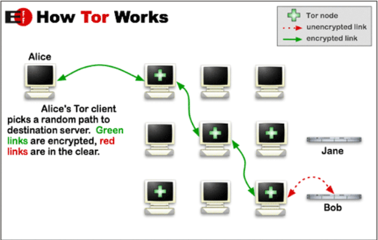
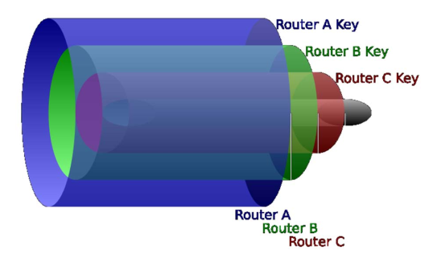

# Laboratorio: TOR, ONION

## Requisitos previos

- Editor de código. En Visual Studio Code, pulsando ctrl+mayus+v renderiza este archivo de manera amigable (Sobre todo para imágenes).
- Máquina GNU/Linux: portátil, máquina virtual, o PC laboratorio (Entrar con credencial LDAP).
- Servidor remoto Google Cloud configurado, con Apache funcionando y el firewall permitiendo conexiones.

## Deep Web

La red habitual y conocida (Clearnet) está formada por direcciones conocidas (Ej: www.ehu.eus), con contenidos en HTML que están indexados y permiten realizar búsquedas para encontrar lo que nos interese.

La Deep Web (internet profunda) está formada por todos aquellos contenidos que no son directamente accesibles a través de internet. Se estima que de todo el contenido que existe:

- El 10% está en Clearnet (el internet que conocemos).
- El 90% está en la Deep Web.

Contenido de la Deep Web:

- Información confidencial o protegida (No suelen estar indexados por buscadores ni se puede acceder directamente a ellos): registros sanitarios, registros académicos, datos bancarios, etc.
- Información "suelta": por ejemplo un archivo HTML que no esté enlazado desde ningún otro.
- Información en formatos no HTML que un navegador no puede leer.
- Contenido no publicable (Censura): contenidos que no pueden publicarse libremente porque pueden acarrear consecuencias.
- Contenido ilegal y/o desagradable (Darknet): tráfico de armas, drogas, personas; material pedófilo; malware; alquiler de hackers, matones, etc.; películas snuff.

Para acceder a la Deep Web hace falta un software especial que proporcione privacidad, anonimato y ejerza de proxy.

Existen varias alternativas que darán acceso a distintos contenidos de la Deep Web: TOR, I2P, Freenet, Zeronet, etc.

## TOR

TOR (The Onion Router) ofrece un método para navegar de forma segura, ya que se oculta la IP de fuente y destino de los nodos que forman la [red](https://community.torproject.org/). Los sitios Onion son direcciones alfanuméricas muy largas, no legibles para humanos, a las que se puede acceder mediante HTTP(S), después de que los paquetes hayan viajado por varios nodos ONION, ocultando el origen y destino de los paquetes. 

Cada vez que hay que hacer una conexión, se calcula un camino aleatorio basado en los nodos de la red:



La información se cifra a capas (como una cebolla) con las claves públicas de los distintos nodos, de modo que cada nodo sólo puede ver cuál es el siguiente:



Utilizando la red TOR se puede acceder a URLs que son inaccesibles de otro modo:

- Dominio `.onion`.
- URLs alfanuméricas: `http://3g2upl4pq6kufc4m.onion/`.

Para encontrar contenidos hay que usar buscadores específicos o sitios donde se recopilen las URLs:

- Buscador Torch (`http://xmh57jrzrnw6insl.onion/`).
- The Hidden Wiki (`http://kpvz7ki2v5agwt35.onion`).

## Navegador TOR

Para acceder a sitios ONION hay que usar un navegador TOR. Descarga el [navegador TOR oficial](https://www.torproject.org/download/) y úsalo para conectarte a [diferentes sitios](https://community.torproject.org/es/onion-services/), como por ejemplo el [New York Times](https://www.nytimesn7cgmftshazwhfgzm37qxb44r64ytbb2dj3x62d2lljsciiyd.onion/).

> ¿Por qué crees que abundan los periódicos entre los sitios que ofrecen servicios ONION?

## Servicio ONION en Google Cloud

### Instalar TOR

Para instalar TOR en el servidor sigue las [instrucciones comunes](https://community.torproject.org/onion-services/setup/install/) (Hay que tener en cuenta que para instalar TOR hay que configurar unos [repositorios APT específicos](https://support.torproject.org/apt/tor-deb-repo/)).

Un vez instalado TOR, para verificar su funcionamiento, ejecutar en el servidor:

```bash
curl -x socks5h://localhost:9050 -s https://check.torproject.org/api/ip
```

Debería devolver algo así:

```json
{"IsTor":true,"IP":"xxx.xxx.xxx.xxx"}
```

### Configurar servicio ONION

Sigue las [instrucciones comunes](https://community.torproject.org/onion-services/setup/) para configurar el servicio ONION. Ten en cuenta que:

- Apache debe estar funcionando y el firewall debe permitir conexiones. Conviene crear una página web nueva para verificar la conexión mediante ONION.
- Hay que editar el archivo de configuración de TOR para añadir un nuevo Hidden Service.
- Para comprobar la conexión ONION deberás usar la dirección ONION generada en el Hidden Service y el navegador TOR.
